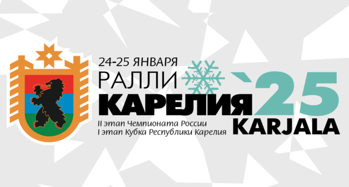
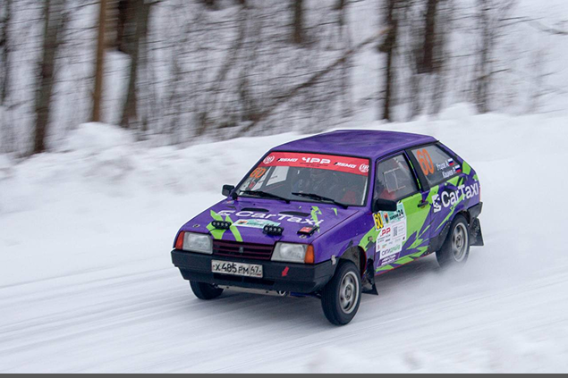
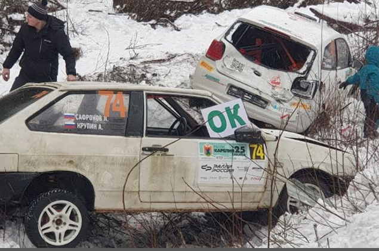

<!DOCTYPE html>
<html lang="ru">
<head>
    <meta charset="UTF-8">
    <meta name="viewport" content="width=device-width, initial-scale=1.0">
    <title>Ралли Карелия</title>
    
</head>
<body>
    

        <!-- Навигационная панель -->
        <nav class="nav-bar">
            <button class="nav-button left">РАЛЛИ КАРЕЛИЯ</button>
            <button class="nav-button middle">Новости</button>
            <button class="nav-button right">Турниры</button>
        </nav>

        <!-- Основной контент -->
        <main class="main-content">
            <!-- Текстовые блоки -->
            

                

                    
Будь
 
                    
первым

                

                

                    
Зритель или пилот -
 
                    
нет права упустить

                    
свой шанс

                    
Каждое мгновение

                    
дарит тонны эмоций

                

            

            <!-- Видео блок -->
            

                <video id="rallyVideo" controls autoplay muted playsinline loop>
                    <source src="video.mp4" type="video/mp4">
                    Ваш браузер не поддерживает воспроизведение видео.
                </video>
                

                    <svg viewBox="0 0 24 24" xmlns="http://www.w3.org/2000/svg">
                        <path d="M3 9v6h4l5 5V4L7 9H3zm13.5 3c0-1.77-1.02-3.29-2.5-4.03v8.05c1.48-.73 2.5-2.25 2.5-4.02zM14 3.23v2.06c2.89.86 5 3.54 5 6.71s-2.11 5.85-5 6.71v2.06c4.01-.91 7-4.49 7-8.77s-2.99-7.86-7-8.77z"/>
                    </svg>
                

            

        </main>

    

    <!-- Блок новостей -->
    <section class="news-section">
        <h2 class="news-header">НОВОСТИ</h2>
        
        <!-- Большой баннер "УЖЕ СКОРО" -->
        

            

                
            

            
УЖЕ СКОРО!

        

        <!-- Маленькие блоки новостей -->
        

            

                
                
Успешный дебют братьев Семёновых на недавнем РК2024!

            

            

                
                
Сход с дистанции - не приговор!
Сафронов и Крупин о своём опыте

            

        

    </section>

    
</body>
</html>
